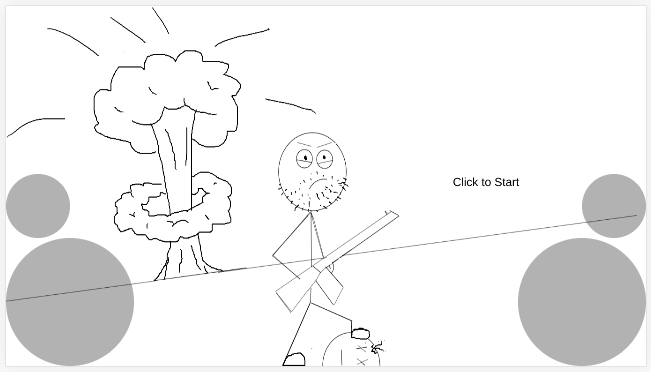

# Aim and Shoot

You're Nole Ksum (the k is silent), a citizen concern about the uprising of the machine who decided to take matters into your own hands and put an end to all artificial intelligence. You must kill all the evil robots controlled by Neural Networks and stop them from evolving into more dangerous beings. The entire human race counts on you, don't let them down.

Play it [here](https://victorribeiro.com/aimAndShoot/)

## How To Play

### Controls

**w, a, s, d** - Move the player up, left, down, right. Arrow keys do the same.

**mouse** - Aims and shoots (click).

### I do not recommend using this on a mobile, but if you must

The big left circle moves the player.  
The big right circle aims the player.  
The two little circles above them, shoot.

You've been warned.

### Objectives

Kill the bots, don't get killed. Also don't touch the borders of the screen, they hurt you. But, feel free to push the bots into them.

### Status Bars

Above the bots there are two status bars.  
The red one indicates health, if it's empty you die.  
The green one is the cool down meter, if it's empty you can't shoot until it regenerates.

## About the Experiment

I've always wanted to take the time to make a [Neuroevolution](https://en.wikipedia.org/wiki/Neuroevolution) experiment, so I did.

Each bot is controlled by it's own Neural Network (that I made a while back - [here](https://github.com/victorqribeiro/digitRecognition)). When all the bots die, the genetic algorithm evaluates their fitness score (based on how many shots they fired, how many hits the got, how many friends they shot, how much they hurt themselves and how much they moved during the round) and cross the ones with the highest scores.

This goes on forever, until the player dies (which will happen eventually, so Nole can't never save the human race, after all). By the way, the background history is a joke. I don't mean to make fun of anyone. The idea just seems funny and fit the project.

*Fun Fact: the artwork was created using my [PaintDraw](https://github.com/victorqribeiro/paintDraw) tool.*

## 2026 Update: fixed and extended with Claude Code

The live version is no longer the 2019 original. In 2026 the game was fixed and extended with [Claude Code](https://claude.com/claude-code):

- **The bots can actually learn now.** Several bugs in the neuroevolution were fixed: each bot sees every player plus its own state, the aim works, the fitness no longer rewards spraying bullets, and the best bot of each generation is kept.
- **Shared evolution.** The bots are no longer reset when you die. They come from one population kept on the server and evolved by everyone who played before you. Your browser only reports how each bot did in the round; the server scores the bots and breeds the next generations. The HUD shows the shared generation and your round. If the server can't be reached, the game falls back to evolving the bots locally, as before.
- **Suggestions from the [2019 Hacker News thread](https://news.ycombinator.com/item?id=21353123).** Your health refills every round, the game-over screen shows the round you reached and your best, the gunshots are quieter (press **M** to mute), bots no longer spawn on top of you, and killing the shooters first no longer breeds pacifists as easily.
- **Fairer gameplay.** Limited fire rate, a short grace period at the start of each round, the same movement speed at any screen refresh rate, a fixed-size arena that scales to fit the screen, and collision fixes.

The backend is PHP with SQLite (`api/`). The GitHub Pages link now redirects to the live version.
